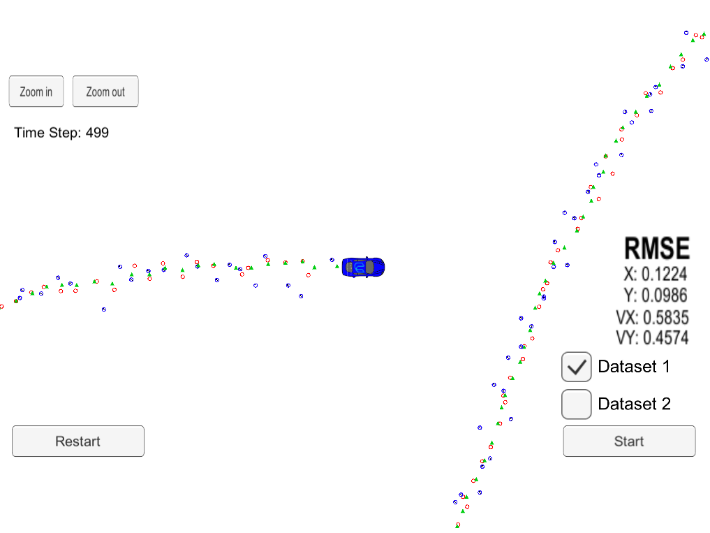
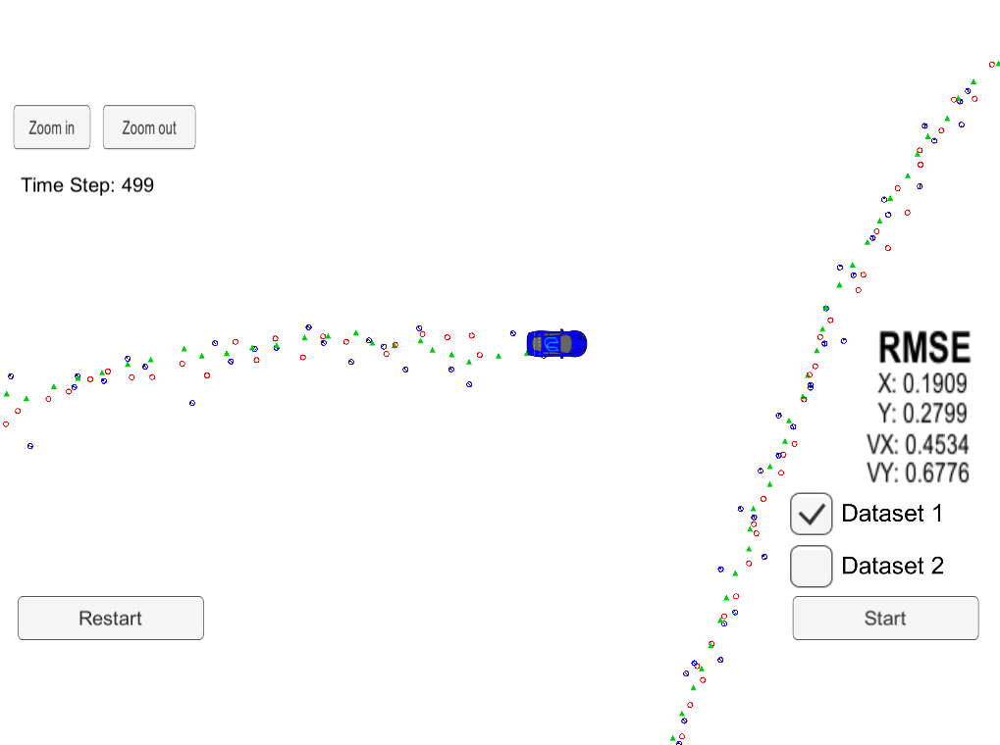
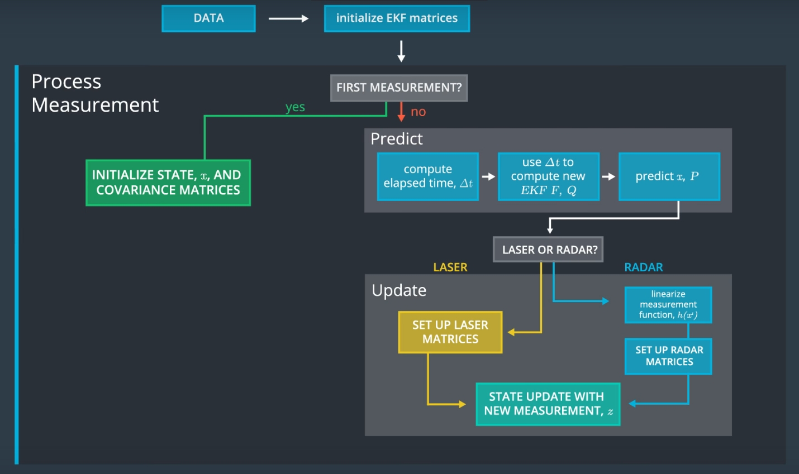

# Extended Kalman Filter(Sensor Fusion)

## Objective:

	Use LIDAR and RADAR sensor data to measure object (e.g. pedestrian, vehicles, bike ... etc),
	to track with the Extended Kalman Filter algorithm.

## Results:

### Dataset 1(Lidar & Radar)
	RMSE (px,py,vx,vy)=(0.0974, 0.0855, 0.4517, 0.4404)< [.11, .11, 0.52, 0.52]
	Result is very good  
 

### Only Lidar
	RMSE (px,py,vx,vy)=(0.1224, 0.0986, 0.5835, 0.4574)> [.11, .11, 0.52, 0.52]
	Result is bad than two sensor devices input. 

 
### Only Radar
	RMSE (px,py,vx,vy)=(0.1909, 0.2799, 0.4534, 0.6776)> [.11, .11, 0.52, 0.52]
	Result is terrible than lidar and two sensor as above, 
	because radar data variance is bigger than lidar variance.
 

## How to run:

	Perform steps following:
	- Clone this repo: git clone https://github.com/HereIsPatrick/CarND-Extended-Kalman-Filter-Project
	- Enter into directory: cd ~/<repository>
	- Make build directory: mkdir build && cd build
	- Compile the code: \cmake .. && make
	- Run the code: ./ExtendedKF
	- Start and run Project 1/2 EKF and UKF of Self Driving Car Simulator
	

## Measurement Process:

 

## How to improve
	Results as above, we can see use multiple sensor device will get more accuracy than one sensor device.
	Tesla Elon musk doesn't think Lidar is necessary.(Maybe is cost issue)
	Other idea.
	1. Use multiple radars(solution is cheaper than Lidar)
	2. Higher Sample rate from radar, we can get more radar data.
	3. Binding Computer Version with Radar. 

